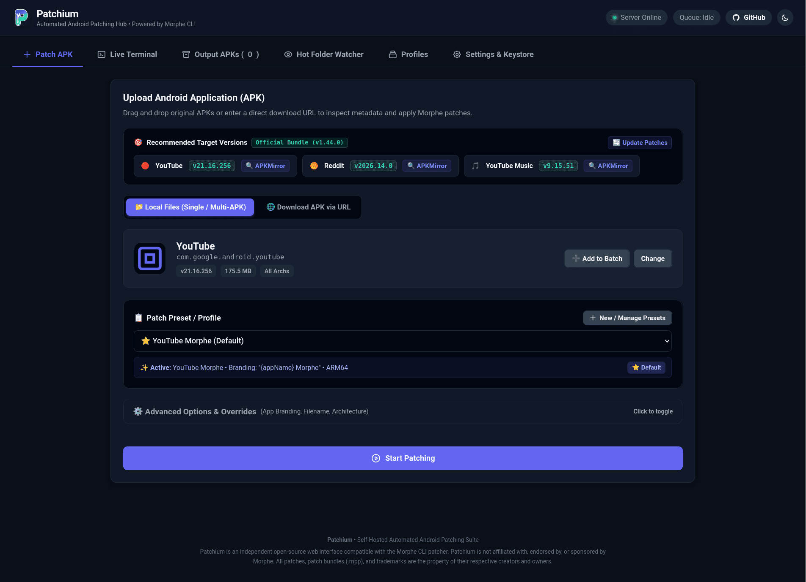
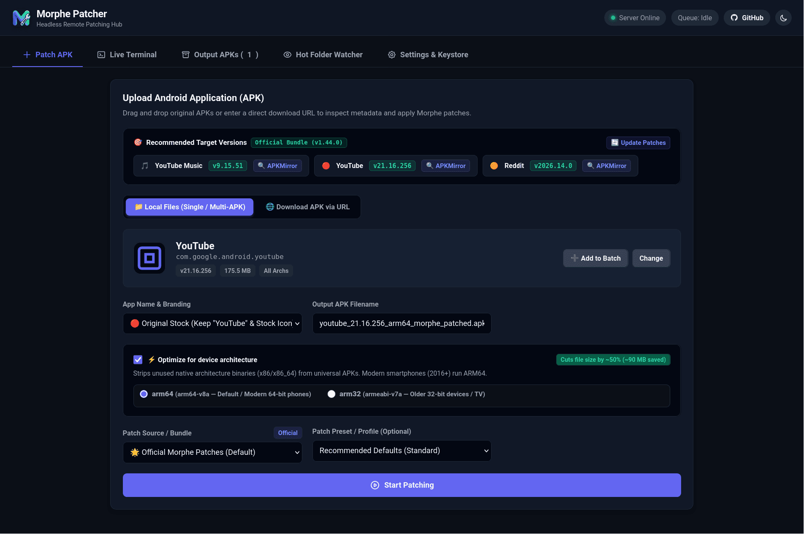
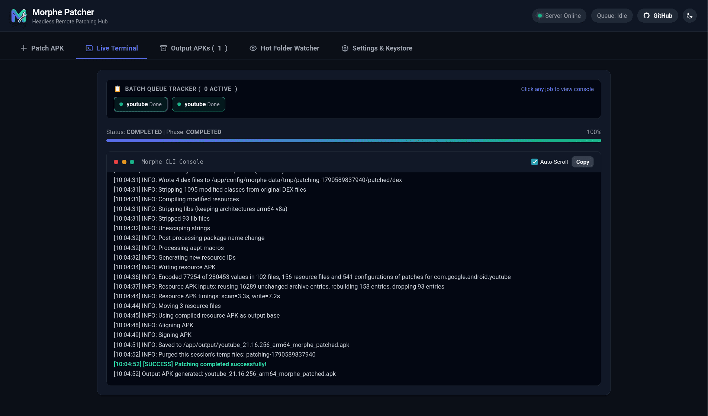
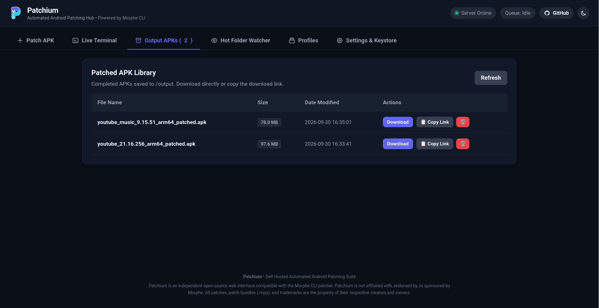
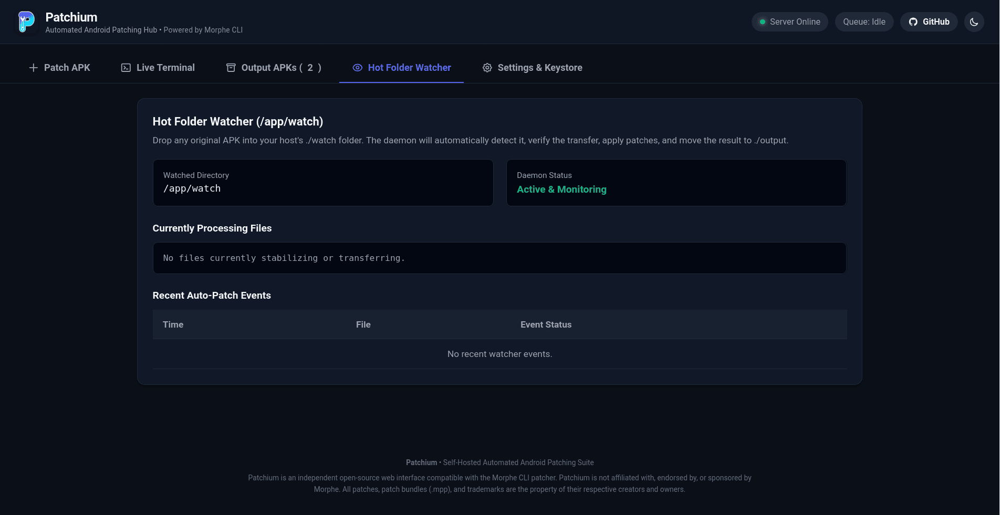
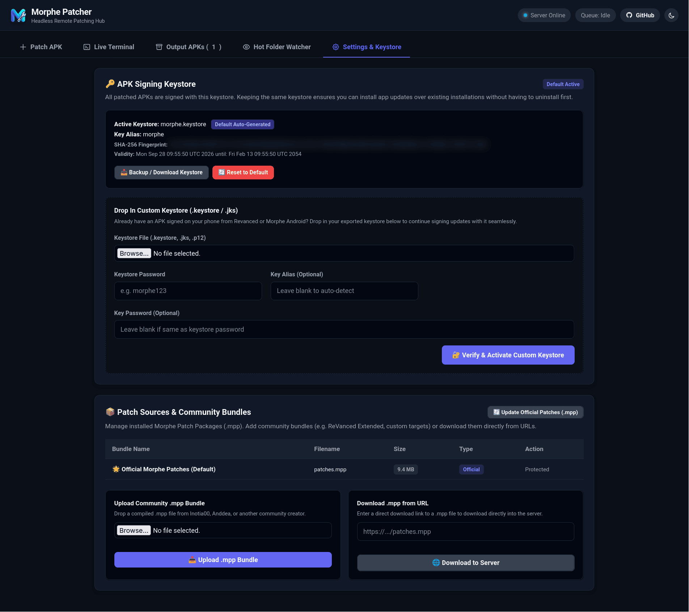
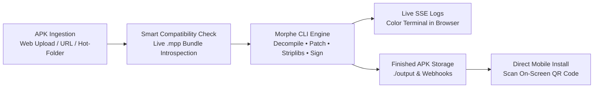

# <p align="center"> Morphe Patcher Web</p>

<p align="center">
  <strong>A feature packed & automated patcher for Morphe with Web Dashboard — built for headless servers.</strong>
</p>

<p align="center">
  <a href="https://github.com/MorpheApp/morphe-desktop"></a>
  <a href="https://github.com/GROWNUPS/Morphe-Patcher-Web/pkgs/container/morphe-patcher-web"></a>
  
  
  
  
</p>

> ⚠️ **Disclaimer & Compliance:**  
> This project is strictly an open-source Web GUI wrapper around the official Morphe CLI. It **does not** host, bundle, or distribute any proprietary APKs, pre-patched binaries, or third-party patches. Users must supply their own legitimate base APKs to patch locally on their own private hardware (BYOA — Bring Your Own APK).

<p align="center"><sub><i>🤖 This project was built with AI assistance and is intended for personal use. It may contain bugs or rough edges. Review the code and use it at your own risk, especially before exposing it beyond your local network 🤖</i></sub></p>

---

## 📸 Screenshots (Dark Mode)

| 1. Dashboard | 2. Upload Inspection |
| :---: | :---: |
|  |  |
| *Target version guidance, APKMirror direct links, and patch bundle overview* | *Drag-and-drop / URL import, package detection, and live compatibility rating* |

| 3. Live Terminal | 4. Output APK Page |
| :---: | :---: |
|  |  |
| *Real-time CLI execution logs streamed via Server-Sent Events* | *Completed APK library, one-click downloads* |

| 5. Hot Folder Watcher | 6. Settings Page — Keystore & Patches |
| :---: | :---: |
|  |  |
| *Automated directory daemon monitoring incoming files and auto-patching jobs* | *In-app 1-click patch bundle updates and persistent Android signing keystore management* |


---

## ⁉️ Why This Exists

Patching Android applications using patchers like Morphe have some friction :

1. **Desktop GUI Clients Require a Graphical Display**: The official Morphe Desktop app is built with Compose Multiplatform/Java and requires a full desktop environment. If you run a headless home server, Unraid/TrueNAS box, Synology NAS, Proxmox VE, or a remote VPS, running a desktop GUI is annoying or requires clunky VNC/RDP containers.
2. **Mobile Patchers Drain and Throttle Your Phone**: Running patchers directly on Android requires massive CPU and RAM overhead for decompiling, modifying bytecode, repacking, and zipaligning. On budget or mid-range devices, this causes aggressive CPU throttling, out-of-memory crashes, rapid battery drain, and forces you to leave your screen awake for minutes.
3. **Manual CLI Workflows are Tedious**: Using the CLI manually requires configuring Java environments, keeping keystores synchronized across updates, checking GitHub releases constantly for new patch bundles, and manually hunting down which specific APK version is supported by the active patches.

### 💡 The Solution: Morphe Patcher Web

**Morphe Patcher Web** turns your always-on home server or homelab into an autonomous, 24/7 patching station:

- **100% Headless & Containerized**: Runs in lightweight Docker containers across x86_64 and ARM64 (Raspberry Pi, mini PCs, NAS devices). No GUI or display server required.
- **Zero Guesswork Target Guidance**: Inspects the patch bundle dynamically via Morphe CLI to show you exact recommended APK versions, and provides 1-click direct search links to APKMirror.
- **Automated Hot-Folder (`./watch`)**: Drop APKs over SMB, NFS, or Nextcloud; the daemon automatically detects them, matches the target package, applies the patches, and moves them to `./output`.
- **Instant Phone Delivery via QR Code**: Once patched, scan the on-screen QR code with your Android camera to download and install the finished APK straight over your local Wi-Fi.
- **Consistent Signatures**: Creates and persists an Android keystore across builds so app updates can be installed without signature mismatch warnings or having to uninstall previous builds.



---

##  
> 🔒
> **Important Security Notice**: Morphe Patcher Web was created for home local area networks (LAN) and trusted homelab environments. The dashboard allows file uploads, arbitrary URL downloads, custom keystore operations, and executes CLI processes on the host.
> 
> **Do NOT expose this application directly to the open internet without an authentication layer and HTTPS reverse proxy!**
> If you want to access Morphe Patcher Web remotely outside your home network, place it behind a **Reverse Proxy** with **Authentication**, or access it through a private overlay network (such as **Tailscale** or **Netbird**).


---

## ✨ Features & Highlights

### 🎯 Smart Version Guidance (Zero Hardcoding)
- **Real-Time Inspection**: Dynamically queries the active `.mpp` patch bundle using Morphe CLI's `list-versions` command.
- **Recommended Target Builds**: Displays current stable target versions for popular apps with exact patch counts.
- **1-Click APKMirror Search**: Click **"🔍 APKMirror"** to instantly open pre-filtered search results for the exact verified release.
- **Live Compatibility Inspection**: When an APK is uploaded or fetched via URL, the dashboard immediately evaluates its version:
  - 🟢 **Optimal Target**: Matches the recommended stable build.
  - 🔵 **Tested Compatible**: Older verified supported build.
  - 🟠 **Experimental**: Cutting-edge dev release (`--include-experimental`).
  - 🔴 **Untested Release Alert**: Warns if an untested Play Store release is uploaded and provides a direct link to acquire the tested version.

### 🔄 Automatic Patches Lifecycle & In-App Updates
- **Automatic Startup Checks**: When enabled (`AUTO_UPDATE_PATCHES=true`), checks GitHub releases on startup and pulls newer `.mpp` bundles seamlessly.
- **1-Click In-App Update**: Click **`[🔄 Update Patches]`** directly in the dashboard to query GitHub, download new patches, and update recommendations in real time without restarting.
- **Community & Custom Bundles**: Easily drop in third-party or custom `.mpp` patch packages via the Web UI or `./config/patches.mpp`.

### 📥 Flexible APK Import
- **Drag & Drop Upload**: Upload APKs directly from your browser.
- **Download via URL**: Paste any direct APK download link or mirror URL to download and inspect APKs directly on the server.
- **Hot-Folder Watcher (`./watch`)**: Drop APKs over SMB/NFS/Nextcloud; the watcher detects transfer completion, matches the app package, and patches automatically.

### 📦 Multi-APK Batch Processing Queue
- Stage and configure multiple APKs at once.
- Customize app names, branding toggles, architecture optimization, and custom patch profiles per item.
- Sequential background worker queue with real-time status badges and progress tracking.

### ✂️ Architecture Optimization (`--striplibs`)
- Toggle **"Optimize for Device Architecture"** (`arm64-v8a` or `armeabi-v7a`) to strip unused native binaries and dramatically reduce the finished APK file size.

### 🖥️ Live Terminal Streaming (SSE)
- Watch the Morphe CLI run in real-time with colorized logs, progress percentages, and phase indicators streamed via Server-Sent Events.

### 🔑 Persistent & Custom Keystore
- Generates a persistent signing keystore on first run so updates install seamlessly on your phone without signature mismatch errors.
- Support for importing custom keystores (`.keystore`, `.jks`, `.p12`) directly via the Web UI or `./config/keystore/`.

### 🛡️ NAS-Friendly Permissions
- Configurable `PUID` and `PGID` ensures output files are immediately readable and writable by your host user without permission conflicts on Synology, Unraid, and Linux servers.

### 🔔 Multi-Platform Webhook Notifications
- Get notified when automated or web patching finishes via **Discord**, **ntfy.sh**, **Gotify**, or custom webhooks.

---

## 🚀 Quick Start

Morphe Patcher Web is distributed as an automated multi-arch container (`linux/amd64` and `linux/arm64`) on GitHub Container Registry (**GHCR**). You can run it instantly without cloning the source code.

---

### Option A: Deploy via Docker Compose (Recommended)

Choose between keeping configuration in a separate `.env` file or defining everything inline:

#### 1. With `.env` File (Clean & Modular)

Ideal if you want to keep your ports, permissions, and webhook URLs neatly separated from your Compose definition.

**`docker-compose.yml`**:
```yaml
services:
  morphe-patcher:
    image: ghcr.io/grownups/morphe-patcher-web:latest
    container_name: morphe-patcher
    ports:
      - "${PORT:-8080}:8080"
    environment:
      - PUID=${PUID:-1000}
      - PGID=${PGID:-1000}
      - TZ=${TZ:-Etc/UTC}
      - JAVA_OPTS=${JAVA_OPTS:--Xms256m -Xmx2048m -XX:+UseContainerSupport}
      - AUTO_WATCH=${AUTO_WATCH:-true}
      - WATCH_DEBOUNCE_SECONDS=${WATCH_DEBOUNCE_SECONDS:-5}
      - WATCH_ACTION_AFTER_PATCH=${WATCH_ACTION_AFTER_PATCH:-archive}
      - AUTO_UPDATE_PATCHES=${AUTO_UPDATE_PATCHES:-true}
      - WEBHOOK_URL=${WEBHOOK_URL:-}
    volumes:
      - ./watch:/app/watch
      - ./output:/app/output
      - ./config:/app/config
      - ./cache:/app/cache
    restart: unless-stopped
```

**`.env`** (create next to `docker-compose.yml`):
```bash
PORT=8080
PUID=1000
PGID=1000
TZ=Etc/UTC

# Hot-Folder Watcher
AUTO_WATCH=true
WATCH_DEBOUNCE_SECONDS=5
WATCH_ACTION_AFTER_PATCH=archive

# Optional Webhook Notifications (Discord, ntfy.sh, Gotify)
WEBHOOK_URL=

# Patches Lifecycle
AUTO_UPDATE_PATCHES=true
```

Start the container:
```bash
docker compose up -d
```

> [!TIP]
> Docker Compose automatically detects and loads the `.env` file in the same directory. If any variable is omitted from `.env`, it automatically falls back to the safe default specified after `:-` (e.g. `${PORT:-8080}`).

---

#### 2. Without `.env` File (Inline / Single File)

If you prefer a single self-contained file without creating an extra `.env` file:

**`docker-compose.yml`**:
```yaml
services:
  morphe-patcher:
    image: ghcr.io/grownups/morphe-patcher-web:latest
    container_name: morphe-patcher
    ports:
      - "8080:8080"
    environment:
      - PUID=1000
      - PGID=1000
      - TZ=Etc/UTC
      - AUTO_WATCH=true
      - AUTO_UPDATE_PATCHES=true
      - WATCH_ACTION_AFTER_PATCH=archive
      # - WEBHOOK_URL=https://discord.com/api/webhooks/...
    volumes:
      - ./watch:/app/watch
      - ./output:/app/output
      - ./config:/app/config
      - ./cache:/app/cache
    restart: unless-stopped
```

Start the container:
```bash
docker compose up -d
```

---

### Option B: Docker CLI (`docker run`)

Run standalone directly from your terminal:

```bash
docker run -d \
  --name morphe-patcher \
  -p 8080:8080 \
  -v ./watch:/app/watch \
  -v ./output:/app/output \
  -v ./config:/app/config \
  -v ./cache:/app/cache \
  --restart unless-stopped \
  ghcr.io/grownups/morphe-patcher-web:latest
```
*(Tip: Pass custom environment flags using `-e KEY=VALUE` or load a `.env` file via `--env-file .env`)*

---

### Option C: Build from Source

```bash
# 1. Clone the repository
git clone https://github.com/GROWNUPS/Morphe-Patcher-Web.git
cd Morphe-Patcher-Web

# 2. Configure environment (optional)
cp .env.example .env

# 3. Launch with Docker Compose
docker compose up -d --build
```

---

### 🌐 Access the Dashboard

Open your browser and navigate to:
```
http://<your-server-ip>:8080
```
(Or the custom port mentioned in env if 8080 is occupied)

---

## 📁 Directory Structure & Mounts

| Host Directory | Container Path | Description |
| :--- | :--- | :--- |
| `./watch` | `/app/watch` | **Hot Folder**: Drop unpatched APKs here to trigger automatic patching. |
| `./output` | `/app/output` | **Destination**: Completed patched APKs are placed here. |
| `./config` | `/app/config` | **Persistence**: Stores the signing keystore, custom patch profiles, and `.mpp` patch bundles. |
| `./cache` | `/app/cache` | Temporary workspace for APK decompilation and rebuilding. |

---

## ⚙️ Configuration Reference (`.env`)

| Variable | Default | Description |
| :--- | :--- | :--- |
| `PORT` | `8080` | Web UI and API HTTP port. |
| `PUID` | `1000` | User ID for file ownership in mounted volumes. |
| `PGID` | `1000` | Group ID for file ownership in mounted volumes. |
| `TZ` | `Etc/UTC` | Container timezone. |
| `JAVA_OPTS` | `-Xms256m -Xmx2048m -XX:+UseContainerSupport` | JVM memory limits for Morphe CLI execution. |
| `AUTO_UPDATE_PATCHES` | `true` | Automatically check GitHub for newer Morphe patch bundles on startup. |
| `AUTO_WATCH` | `true` | Enables/disables the background hot-folder daemon. |
| `WATCH_DEBOUNCE_SECONDS` | `5` | Seconds file size must stay stable before starting auto-patch. |
| `WATCH_ACTION_AFTER_PATCH`| `archive` | Action on source APK: `archive` (moves to `watch/processed`), `delete`, or `keep`. |
| `WEBHOOK_URL` | `""` | Optional webhook endpoint (Discord, ntfy.sh, Gotify) for completion alerts. |
| `MORPHE_PATCHES_REPO` | `MorpheApp/morphe-patches` | Upstream GitHub repository checked for patch updates. |

---

## 🛠️ Custom Patches & Offline Mode

By default, the container automatically retrieves the official Morphe Desktop JAR and latest `patches.mpp` bundle from GitHub.

For offline environments or custom community builds:
- Place your `.jar` in `./config/morphe-desktop.jar`
- Place your `.mpp` in `./config/patches.mpp` (or upload via the **Settings & Keystore** tab in the dashboard).

---

## ⚖️ Disclaimer & Credits

> ⚠️ **Compliance Notice**: This project is strictly an open-source Web GUI wrapper around the official Morphe CLI. It **does not** host, bundle, or distribute any proprietary APKs, pre-patched binaries, or third-party patches. Users must supply their own legitimate base APKs to patch locally on their own private hardware (BYOA — Bring Your Own APK).

This project is an independent, community-driven open-source web interface and automation wrapper.

- All patching capabilities and patch definitions are powered by **[Morphe](https://github.com/MorpheApp)**.
- This project is not officially affiliated with or endorsed by Morphe or any modified application.
- Please support the Morphe developers and project maintainers **[here](https://morphe.software/donate)**.
